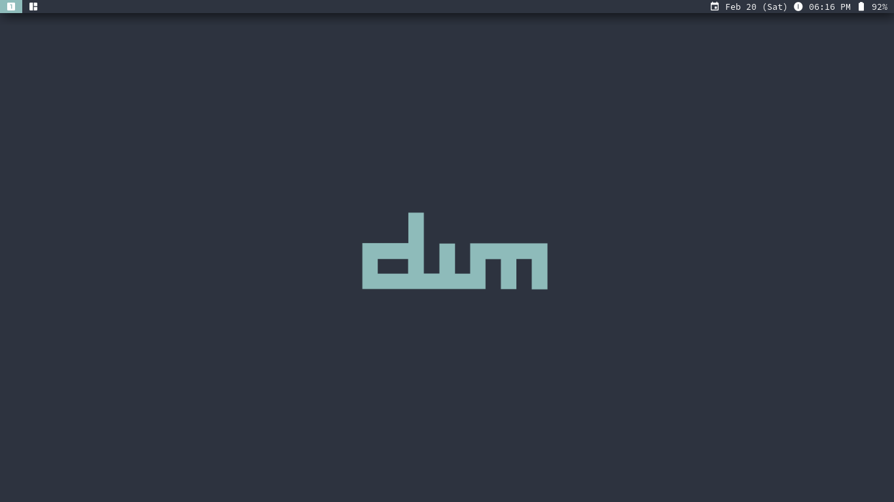

# Dynamic Window Manager

Fork of Suckless' [dwm] with [Nord][nord] color scheme and applied patches.

## Patches

- [actualfullscreen]: Toggles fullscreen for a client window.
- [fullgaps]: Adds gaps between client windows.
- [monoclesymbol]: Allows a custom monocle symbol.
- [hide_vacant_tags]: Prevents drawing of tags with no client windows.

## Installation

- `sudo make install`: To build and install.
- `sudo make uninstall`: To remove installed files.

> **Note**: Use [makepkg] for Arch-based distros.

## Dependencies

Debian-based build dependencies:

- libx11-dev: X11 client-side library.
- libxinerama-dev: X11 Xinerama extension library.
- libxft-dev: FreeType-based font drawing library for X.
- libfreetype6-dev: FreeType2 font rasterization library.

Additional runtime dependencies:

- [dmenu]: Application and script launcher.
- [source-code-pro]: Default general text font.
- [material-design-icons]: Font for custom symbols.

[dwm]: https://dwm.suckless.org
[nord]: https://www.nordtheme.com
[xinit]: https://wiki.archlinux.org/index.php/Xinit
[actualfullscreen]: https://dwm.suckless.org/patches/actualfullscreen
[fullgaps]: https://dwm.suckless.org/patches/fullgaps
[monoclesymbol]: https://dwm.suckless.org/patches/monoclesymbol
[hide_vacant_tags]: https://dwm.suckless.org/patches/hide_vacant_tags
[makepkg]: https://wiki.archlinux.org/index.php/makepkg
[dmenu]: https://github.com/Yuriusu/dmenu
[source-code-pro]: https://github.com/adobe-fonts/source-code-pro
[material-design-icons]: https://github.com/Templarian/MaterialDesign-Webfont
